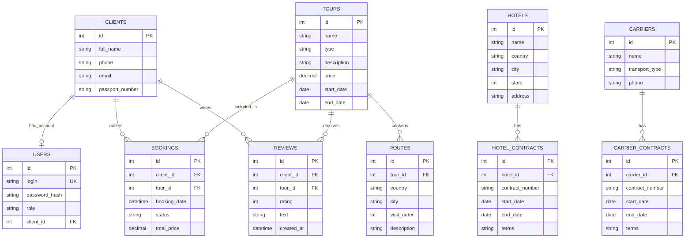

# ER Diagram / схема БД

```mermaid
erDiagram
    CLIENTS ||--o| USERS : has_account
    CLIENTS ||--o{ BOOKINGS : makes
    TOURS ||--o{ BOOKINGS : included_in
    TOURS ||--o{ ROUTES : contains
    CLIENTS ||--o{ REVIEWS : writes
    TOURS ||--o{ REVIEWS : receives
    HOTELS ||--o{ HOTEL_CONTRACTS : has
    CARRIERS ||--o{ CARRIER_CONTRACTS : has

    CLIENTS {
        int id PK
        string full_name
        string phone
        string email
        string passport_number
    }
    USERS {
        int id PK
        string login UK
        string password_hash
        string role
        int client_id FK
    }
    TOURS {
        int id PK
        string name
        string type
        string description
        decimal price
        date start_date
        date end_date
    }
    ROUTES {
        int id PK
        int tour_id FK
        string country
        string city
        int visit_order
        string description
    }
    BOOKINGS {
        int id PK
        int client_id FK
        int tour_id FK
        datetime booking_date
        string status
        decimal total_price
    }
    REVIEWS {
        int id PK
        int client_id FK
        int tour_id FK
        int rating
        string text
        datetime created_at
    }
    HOTELS {
        int id PK
        string name
        string country
        string city
        int stars
        string address
    }
    CARRIERS {
        int id PK
        string name
        string transport_type
        string phone
    }
    HOTEL_CONTRACTS {
        int id PK
        int hotel_id FK
        string contract_number
        date start_date
        date end_date
        string terms
    }
    CARRIER_CONTRACTS {
        int id PK
        int carrier_id FK
        string contract_number
        date start_date
        date end_date
        string terms
    }
```
