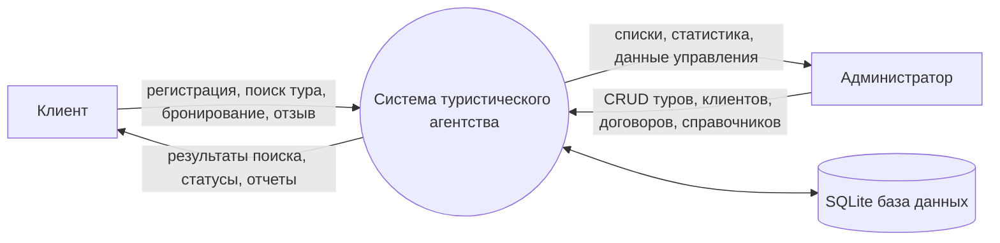
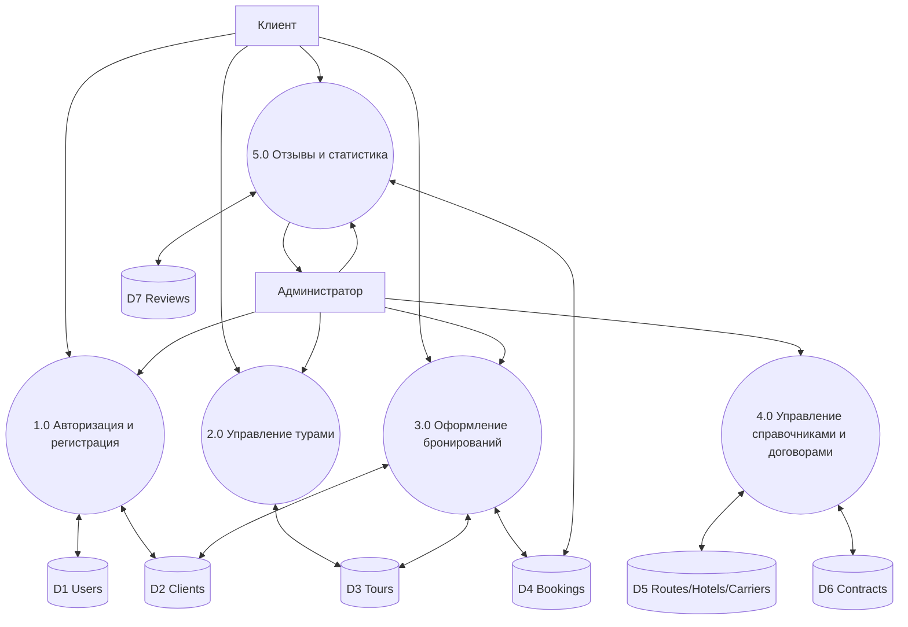

# DFD: система туристического агентства

## DFD Level 0

```mermaid
flowchart LR
    Client[Клиент]
    Admin[Администратор]
    System((Система туристического агентства))
    DB[(SQLite база данных)]

    Client -->|регистрация, поиск тура, бронирование, отзыв| System
    Admin -->|CRUD туров, клиентов, договоров, справочников| System
    System -->|результаты поиска, статусы, отчеты| Client
    System -->|списки, статистика, данные управления| Admin
    System <--> DB
```

## DFD Level 1

```mermaid
flowchart TD
    Client[Клиент]
    Admin[Администратор]

    P1((1.0 Авторизация и регистрация))
    P2((2.0 Управление турами))
    P3((3.0 Оформление бронирований))
    P4((4.0 Управление справочниками и договорами))
    P5((5.0 Отзывы и статистика))

    D1[(D1 Users)]
    D2[(D2 Clients)]
    D3[(D3 Tours)]
    D4[(D4 Bookings)]
    D5[(D5 Routes/Hotels/Carriers)]
    D6[(D6 Contracts)]
    D7[(D7 Reviews)]

    Client --> P1
    Admin --> P1
    P1 <--> D1
    P1 <--> D2

    Client --> P2
    Admin --> P2
    P2 <--> D3

    Client --> P3
    Admin --> P3
    P3 <--> D2
    P3 <--> D3
    P3 <--> D4

    Admin --> P4
    P4 <--> D5
    P4 <--> D6

    Client --> P5
    Admin --> P5
    P5 <--> D4
    P5 <--> D7
    P5 --> Admin
```
