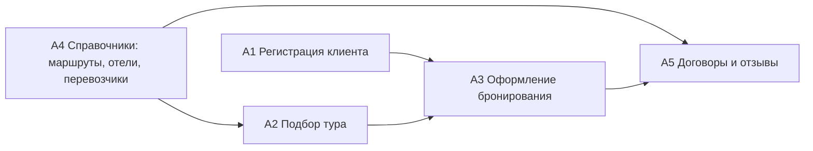

# IDEF0: автоматизация регистрации тура

## Контекстная диаграмма A-0

```text
                          УПРАВЛЕНИЕ
       правила оформления, цены туров, договоры, законодательство
                                ↓
ВХОДЫ →        [A-0 Автоматизация регистрации тура]        → ВЫХОДЫ
данные клиента, выбранный тур, данные паспорта, отзыв        карточка клиента,
                                                             бронирование,
                                                             договорные данные,
                                                             статистика,
                                                             отзыв
                                ↑
                            МЕХАНИЗМЫ
        менеджер/администратор, клиент, Tkinter UI, FastAPI API,
                 SQLite, SQLAlchemy ORM, SQL-запросы
```

## Декомпозиция A0

| Блок | Функция | Входы | Управление | Механизмы | Выходы |
|---|---|---|---|---|---|
| A1 | Регистрация и авторизация | логин, пароль, данные клиента | роли `admin/client`, уникальность логина | FastAPI, bcrypt, SQLite | учетная запись, профиль клиента |
| A2 | Подбор и ведение туров | параметры поиска, данные тура | типы туров, цена, даты | ORM-репозиторий, SQL-репозиторий | список туров, карточка тура |
| A3 | Оформление бронирования | клиент, тур | наличие клиента и тура, статус брони | Booking endpoint, БД | бронирование, итоговая цена |
| A4 | Ведение справочников | маршруты, отели, перевозчики | договорные условия | CRUD endpoint, БД | маршруты, отели, перевозчики |
| A5 | Договоры и отзывы | договоры, оценка клиента | сроки договора, рейтинг 1-5 | FastAPI, SQLite | договоры, отзывы, статистика |

## Связь блоков


