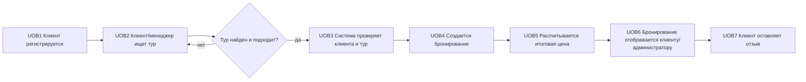
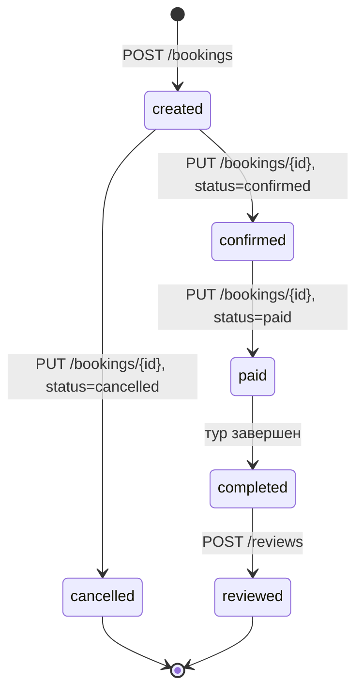

# IDEF3: сценарий оформления тура

## Process Flow Description

## Object State Transition для бронирования

## Описание UOB

| UOB | Действие | Результат |
|---|---|---|
| UOB1 | Вводятся регистрационные данные клиента | создаются записи `clients` и `users` |
| UOB2 | Выполняется поиск тура по названию, типу и цене | возвращается список подходящих туров |
| UOB3 | API проверяет существование клиента и тура | исключается бронирование несуществующих данных |
| UOB4 | Создается запись в `bookings` | фиксируются клиент, тур, статус и дата |
| UOB5 | Цена бронирования берется из выбранного тура | формируется `total_price` |
| UOB6 | Администратор/клиент получает список бронирований | бронирование доступно для просмотра |
| UOB7 | Клиент отправляет отзыв | создается запись в `reviews` |
