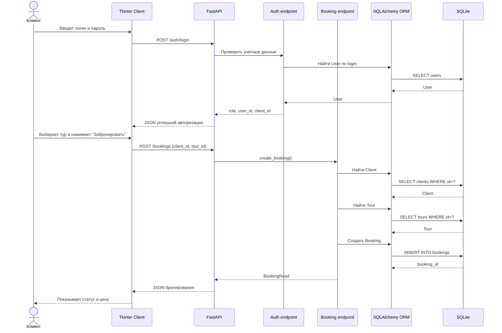

# UML Sequence Diagram: оформление бронирования

```mermaid
sequenceDiagram
    actor Client as Клиент
    participant UI as Tkinter Client
    participant API as FastAPI
    participant Auth as Auth endpoint
    participant Booking as Booking endpoint
    participant ORM as SQLAlchemy ORM
    participant DB as SQLite

    Client->>UI: Вводит логин и пароль
    UI->>API: POST /auth/login
    API->>Auth: Проверить учетные данные
    Auth->>ORM: Найти User по login
    ORM->>DB: SELECT users
    DB-->>ORM: User
    ORM-->>Auth: User
    Auth-->>API: role, user_id, client_id
    API-->>UI: JSON успешной авторизации

    Client->>UI: Выбирает тур и нажимает "Забронировать"
    UI->>API: POST /bookings {client_id, tour_id}
    API->>Booking: create_booking()
    Booking->>ORM: Найти Client
    ORM->>DB: SELECT clients WHERE id=?
    DB-->>ORM: Client
    Booking->>ORM: Найти Tour
    ORM->>DB: SELECT tours WHERE id=?
    DB-->>ORM: Tour
    Booking->>ORM: Создать Booking
    ORM->>DB: INSERT INTO bookings
    DB-->>ORM: booking_id
    Booking-->>API: BookingRead
    API-->>UI: JSON бронирования
    UI-->>Client: Показывает статус и цену
```
