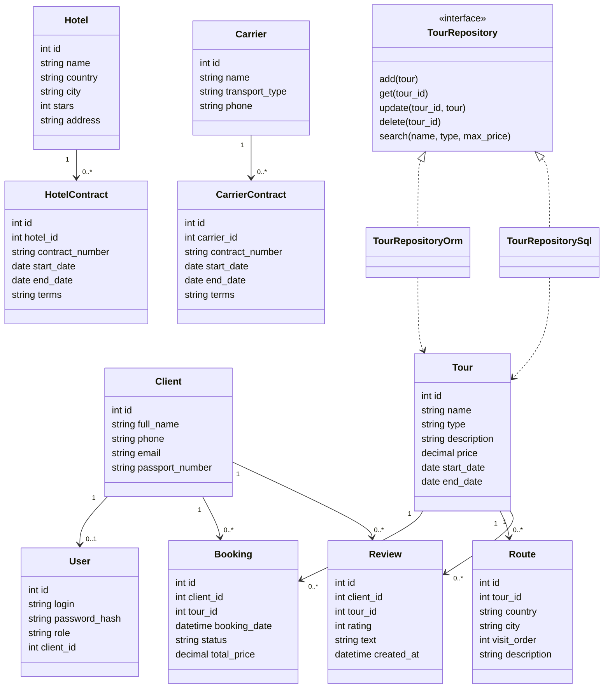

# UML Class Diagram

```mermaid
classDiagram
    class User {
        int id
        string login
        string password_hash
        string role
        int client_id
    }

    class Client {
        int id
        string full_name
        string phone
        string email
        string passport_number
    }

    class Tour {
        int id
        string name
        string type
        string description
        decimal price
        date start_date
        date end_date
    }

    class Route {
        int id
        int tour_id
        string country
        string city
        int visit_order
        string description
    }

    class Booking {
        int id
        int client_id
        int tour_id
        datetime booking_date
        string status
        decimal total_price
    }

    class Review {
        int id
        int client_id
        int tour_id
        int rating
        string text
        datetime created_at
    }

    class Hotel {
        int id
        string name
        string country
        string city
        int stars
        string address
    }

    class Carrier {
        int id
        string name
        string transport_type
        string phone
    }

    class HotelContract {
        int id
        int hotel_id
        string contract_number
        date start_date
        date end_date
        string terms
    }

    class CarrierContract {
        int id
        int carrier_id
        string contract_number
        date start_date
        date end_date
        string terms
    }

    class TourRepository {
        <<interface>>
        add(tour)
        get(tour_id)
        update(tour_id, tour)
        delete(tour_id)
        search(name, type, max_price)
    }

    class TourRepositoryOrm
    class TourRepositorySql

    Client "1" --> "0..1" User
    Client "1" --> "0..*" Booking
    Client "1" --> "0..*" Review
    Tour "1" --> "0..*" Booking
    Tour "1" --> "0..*" Route
    Tour "1" --> "0..*" Review
    Hotel "1" --> "0..*" HotelContract
    Carrier "1" --> "0..*" CarrierContract
    TourRepository <|.. TourRepositoryOrm
    TourRepository <|.. TourRepositorySql
    TourRepositoryOrm ..> Tour
    TourRepositorySql ..> Tour
```
