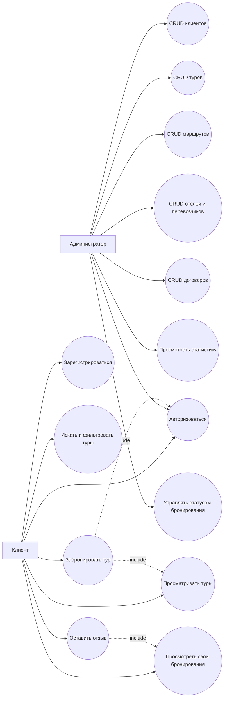

# UML Use Case Diagram

```mermaid
flowchart LR
    Client[Клиент]
    Admin[Администратор]

    UC1((Зарегистрироваться))
    UC2((Авторизоваться))
    UC3((Просматривать туры))
    UC4((Искать и фильтровать туры))
    UC5((Забронировать тур))
    UC6((Просмотреть свои бронирования))
    UC7((Оставить отзыв))

    UC8((CRUD клиентов))
    UC9((CRUD туров))
    UC10((CRUD маршрутов))
    UC11((CRUD отелей и перевозчиков))
    UC12((CRUD договоров))
    UC13((Просмотреть статистику))
    UC14((Управлять статусом бронирования))

    Client --> UC1
    Client --> UC2
    Client --> UC3
    Client --> UC4
    Client --> UC5
    Client --> UC6
    Client --> UC7

    Admin --> UC2
    Admin --> UC8
    Admin --> UC9
    Admin --> UC10
    Admin --> UC11
    Admin --> UC12
    Admin --> UC13
    Admin --> UC14

    UC5 -. include .-> UC3
    UC5 -. include .-> UC2
    UC7 -. include .-> UC6
```
